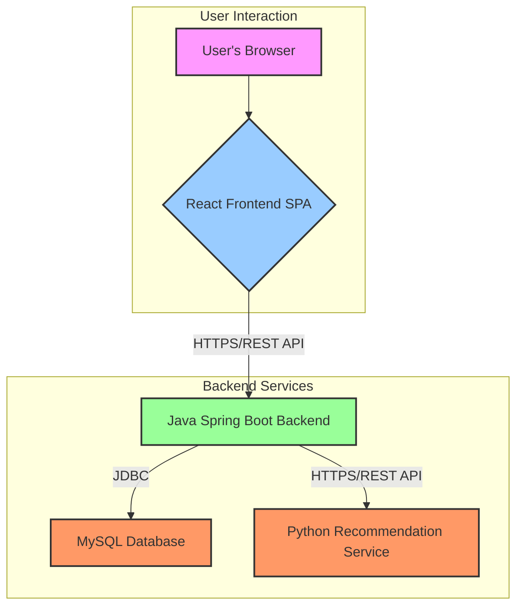
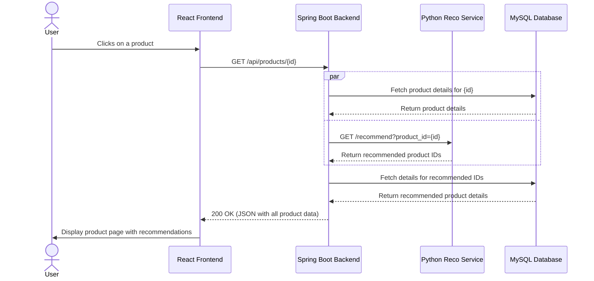

# EcoStore: System Design Documentation

This document provides a detailed overview of the EcoStore application's architecture, components, and data flow.

---

## 1. High-Level Architecture

The EcoStore application is built on a **multi-tiered, service-oriented architecture**. This decoupled design allows each part of the system to be developed, scaled, and maintained independently. It consists of three primary components:

1.  A **React single-page application (SPA)** for the frontend.
2.  A core **Java Spring Boot application** for the backend business logic.
3.  A specialized **Python Flask microservice** for product recommendations.

### Architectural Diagram

The following diagram illustrates the high-level architecture of the system:

---

## 2. Component Breakdown

### 2.1. Frontend (React) - The Presentation Layer

*   **Technology**: Built with **React** and **Material-UI** for a modern and responsive user interface.
*   **Responsibilities**:
    *   **User Interface (UI)**: Renders all pages and components the user interacts with.
    *   **State Management**: Manages client-side state (e.g., shopping cart, auth status).
    *   **API Communication**: Interacts with the backend via REST API calls to fetch data and handle user actions.

### 2.2. Backend (Java Spring Boot) - The Core Business Logic Layer

*   **Technology**: A robust backend built with **Spring Boot**, using **Spring Security** for authentication and **JPA/Hibernate** for database interaction.
*   **Responsibilities**: This is the brain of the application.
    *   **API Gateway**: Exposes all REST endpoints consumed by the frontend.
    *   **Business Logic**: Implements all core features, including user authentication (JWT), order management, the EcoCoin loyalty system, and the product rating system.
    *   **Data Persistence**: Acts as the single source of truth, communicating with the MySQL database.
    *   **Service Integration**: Communicates with the Python recommendation service to fetch product suggestions.

### 2.3. Recommendation Service (Python/Flask) - The Specialized Microservice

*   **Technology**: A lightweight microservice built with **Python**, **Flask**, and ML libraries like **scikit-learn** and **pandas**.
*   **Responsibilities**: Its sole purpose is to provide intelligent product recommendations.
    *   **Machine Learning Models**: Hosts pre-trained ML models (content-based and collaborative filtering) to generate recommendations.
    *   **Recommendation API**: Exposes a simple REST endpoint that the Spring Boot backend calls to get recommendations.
*   **Design Rationale**: Separating this service allows us to use the best tool (Python) for machine learning without complicating the main Java application.

### 2.4. Database (MySQL) - The Persistence Layer

*   **Technology**: A **MySQL relational database**.
*   **Responsibilities**:
    *   **Data Storage**: Persistently stores all application data (users, products, orders).
    *   **Data Integrity**: Enforces data consistency and reliability through **ACID compliance**, which is critical for handling financial transactions securely.

---

## 3. Communication and Data Flow

This section illustrates how the components work together during a typical user interaction.

### Example Flow: User Viewing a Product Page

1.  **User Request**: The user navigates to a product detail page in their browser.
2.  **Frontend to Backend**: The React app calls the Spring Boot backend (`GET /api/products/{id}`).
3.  **Backend Logic**: The Spring Boot service receives the request and performs two actions in parallel:
    *   It fetches the main product details from the **MySQL database**.
    *   It makes an HTTP request to the **Python Recommendation Service**.
4.  **Recommendation Service**: The Python service uses its ML models to generate a list of recommended product IDs and returns it to the Spring Boot backend.
5.  **Data Aggregation**: The Spring Boot backend takes the list of recommended IDs and fetches their full details from the **MySQL database**.
6.  **Response to Frontend**: The backend bundles the main product details and the list of recommended products into a single JSON response and sends it back to the React app.
7.  **UI Rendering**: The React app receives the data and renders the complete product page, including the 'Similar Products' carousel.

### Data Flow Sequence Diagram

